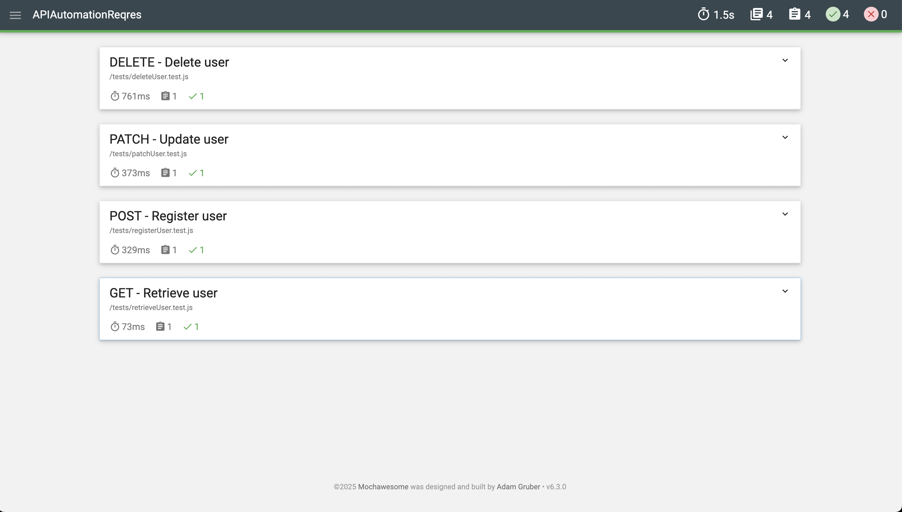

# 🧪 API Automation Testing – ReqRes.in

This project demonstrates API automation testing using **Mocha**, **Chai**, and **Mochawesome** on the [ReqRes public API](https://reqres.in/).  
Developed as part of the **Digital Skola QA Bootcamp Batch 12** by **Putri Stephanie Lesilolo**.

---

## 📂 Project Structure
```
APIAutomationReqres/
├── tests/
│ ├── getListUser.test.js
│ ├── postRegister.test.js
│ ├── patchUser.test.js
│ └── deleteUser.test.js
├── reports/
│ └── api-report.html
│ └── sample-report-screenshot.png
├── package.json
└── README.md
```

---

## 🧰 Tools & Libraries

| Library | Description |
|----------|--------------|
| **Mocha** | JavaScript test framework for running API tests |
| **Chai** | Assertion library used for validating responses |
| **Mochawesome** | HTML test reporting for Mocha |
| **AJV** | JSON schema validation |
| **Node-fetch** | Used to make HTTP requests |

## ⚙️ Installation & Setup

1. Clone the repo:
   ```
   git clone https://github.com/putristphn/APIAutomationReqres.git
   ```
2. Navigate into the folder:
   ```
   cd APIAutomationReqres
   ```
3. Install dependencies:
   ```
   npm install
   ```

   ---

  ##  🧪 Running the Tests   

- Option 1: Run all tests
```
npm run test:all
```
- Option 2: Run specific test file
```
npm run test:unit -- tests/deleteUser.test.js
```

  ---

  ##  📊 View Test Report

  After running all tests, open the generated HTML report:
  ```
  open reports/api-report.html   # (Mac)
  start reports\api-report.html  # (Windows) 
  ```

   ---
  
 ## 📁 Test Coverage

| Method | Endpoint        | Description          | Expected Status | Notes                         |
| ------ | --------------- | -------------------- | --------------- | ----------------------------- |
| GET    | `/api/users/2`  | Retrieve single user | 200             | Validates user data presence  |
| POST   | `/api/register` | Register user        | 200             | Validates `id` & `token`      |
| PATCH  | `/api/users/2`  | Update user info     | 200             | Validates `job` & `updatedAt` |
| DELETE | `/api/users/2`  | Delete user          | 204             | Validates empty response body |

All tests include assertions for:
- Response status code
- Response body fields
- Data validation consistency
- Empty body verification (DELETE)
- API Key Authentication → (`x-api-key`: `reqres-free-v1`)

--- 

## 📸 Example Test Report (Mochawesome)

Here’s an example of the Mochawesome HTML report generated after running all tests:



--- 

## 🧠 Key Learnings

- Writing structured API test suites with Mocha
- Using Chai’s BDD assertions (`expect`) for readability
- Implementing API key authentication
- Handling async/await test execution
- Generating HTML reports for visual test summaries

---

## 👩🏻‍💻 Author

**Putri Stephanie Lesilolo**  
*Quality Assurance Engineer*  
📍 Jakarta, Indonesia  

🔗 [LinkedIn](https://www.linkedin.com/in/putrilesilolo/) | [GitHub](https://github.com/putristphn)

